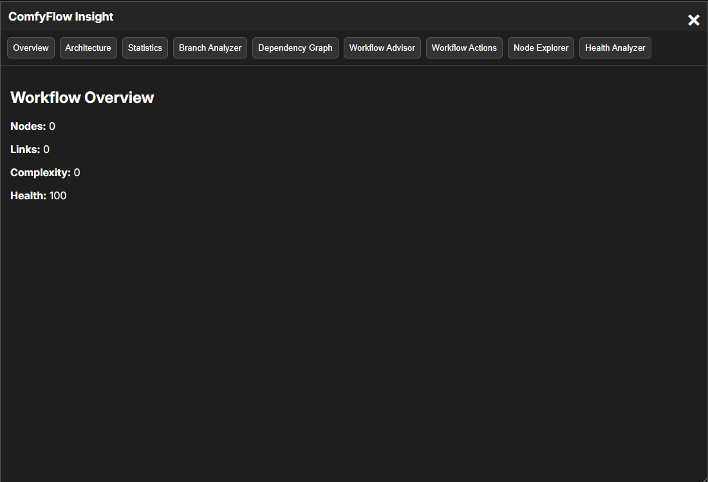
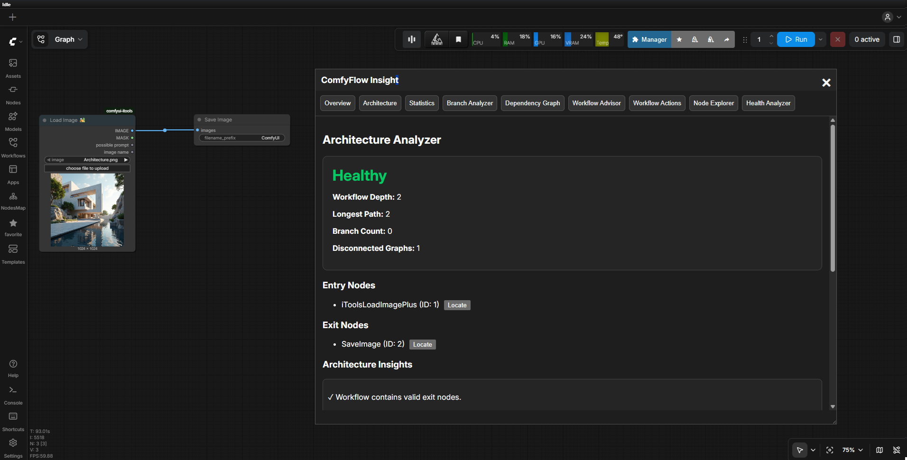
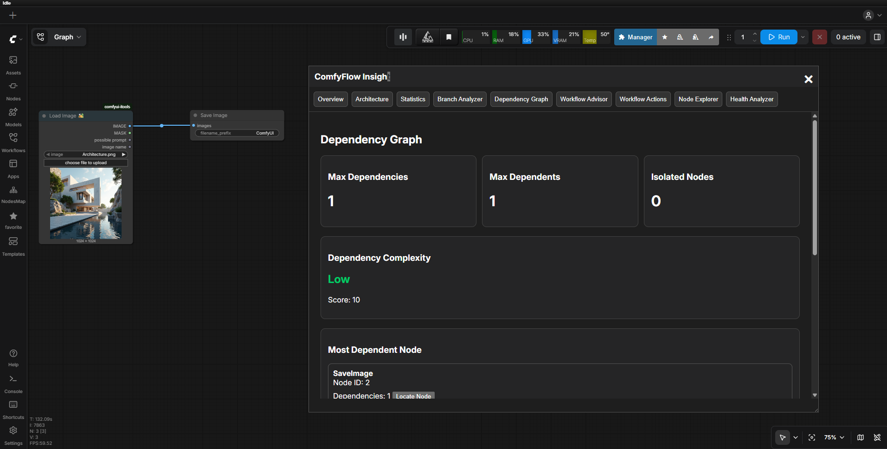
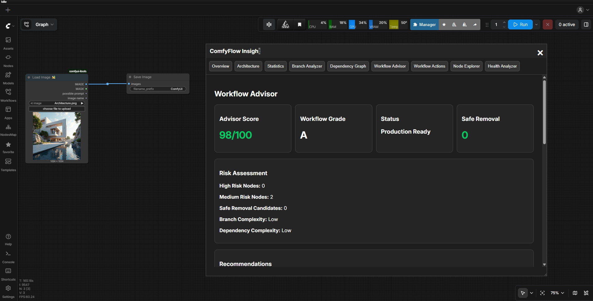
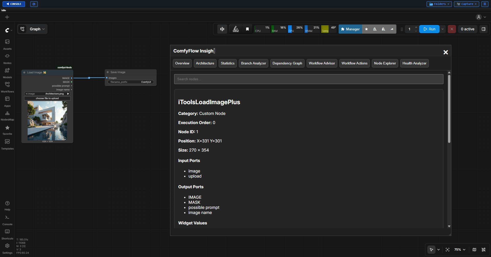
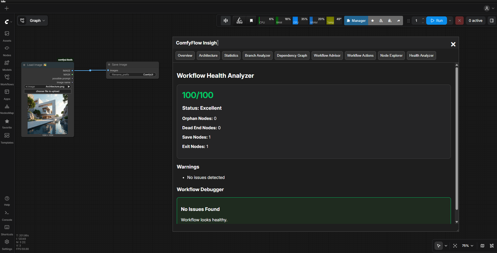

<div align="center">


# ComfyFlow Insight

### Advanced Workflow Intelligence Platform for ComfyUI

**Analyze • Understand • Navigate • Audit • Diagnose • Optimize • Document ComfyUI Workflows**

Workflow Overview • Architecture Analysis • Workflow Statistics • Branch Analysis • Dependency Mapping • Workflow Advisor • Node Explorer • Health Diagnostics

<p align="center">


</p>

<p align="center">
  <a href="#-installation">📥 Install</a>
  &nbsp;·&nbsp;
  <a href="#-dashboard-modules">📊 Dashboard</a>
  &nbsp;·&nbsp;
  <a href="#-documentation">📖 Documentation</a>
  &nbsp;·&nbsp;
  <a href="#-project-structure">🏗 Architecture</a>
  &nbsp;·&nbsp;
  <a href="#-roadmap">🛠 Roadmap</a>
  &nbsp;·&nbsp;
  <a href="#-contributing">🤝 Contributing</a>
</p>

</div>

---

<p align="center">
  
</p>


---

# 🚀 What is ComfyFlow Insight?

ComfyFlow Insight is a workflow engineering and analysis platform built specifically for ComfyUI.

As workflows become larger and more complex, understanding workflow architecture, dependencies, health, and maintainability becomes increasingly difficult.

ComfyFlow Insight transforms complex ComfyUI workflows into understandable engineering assets through automated analysis.

---

# 🎯 Key Features

### 📊 Workflow Overview

Get an instant summary of workflow size and quality.

Provides:

* Total Nodes
* Total Links
* Complexity Score
* Health Score

---

### 🏗 Architecture Analyzer

Understand workflow structure and execution flow.

Provides:

* Entry Nodes
* Exit Nodes
* Workflow Depth
* Longest Path
* Branch Count
* Architecture Complexity



---

### 📈 Workflow Statistics

Engineering metrics for workflow evaluation.

Provides:

* Node Count
* Link Count
* Workflow Density
* Complexity Score
* Workflow Scale

---

### 🌳 Branch Analyzer

Analyze workflow branching behavior.

Provides:

* Branch Count
* Branch Density
* Parallel Paths
* Branch Complexity

---

### 🔗 Dependency Graph

Understand workflow relationships and impact.

Provides:

* Max Dependencies
* Max Dependents
* Isolated Nodes
* Dependency Complexity
* Most Dependent Node
* Dependency Mapping


---

### 🧠 Workflow Advisor

Workflow intelligence and recommendation engine.

Provides:

* Workflow Score
* Workflow Grade
* Workflow Status
* Engineering Recommendations
* Risk Assessment


---

### 🎯 Workflow Actions

Workflow navigation utilities.

Provides:

* Locate Node
* Select Node
* Zoom To Node

---

### 📋 Node Explorer

Complete workflow inventory system.

Provides:

* Node Discovery
* Node IDs
* Node Types
* Workflow Visibility
* Workflow Auditing


---

### ❤️ Health Analyzer

Workflow quality assurance engine.

Provides:

* Health Score
* Orphan Node Detection
* Dead-End Node Detection
* Missing Output Detection
* Workflow Integrity Checks


---

# 🖥 Dashboard Modules

Current Dashboard Tabs:

```text
Overview

Architecture

Statistics

Branch Analyzer

Dependency Graph

Workflow Advisor

Workflow Actions

Node Explorer

Health Analyzer
```

---

# 🔄 Analysis Pipeline

```text
Workflow
    ↓

Overview
    ↓

Architecture Analyzer
    ↓

Workflow Statistics
    ↓

Branch Analyzer
    ↓

Dependency Graph
    ↓

Workflow Advisor
    ↓

Node Explorer
    ↓

Health Analyzer
```

---

# 📂 Project Structure

```text
ComfyUI-ComfyFlow-Insight/

├── backend/
│   ├── graph_engine.py
│   ├── optimization_engine.py
│   ├── scoring_engine.py
│   └── workflow_parser.py
│
├── docs/
│   ├── installation-guide.md
│   ├── dashboard-guide.md
│   ├── architecture-analyzer.md
│   ├── workflow-statistics.md
│   ├── branch-analyzer.md
│   ├── dependency-graph.md
│   ├── workflow-advisor.md
│   ├── node-explorer.md
│   ├── health-analyzer.md
│   └── faq.md
│
├── nodes/
│
├── web/
│
├── assets/
│
├── __init__.py
│
└── requirements.txt
```

---

# 📖 Documentation

Detailed documentation is available in:

```text
docs/
```

Included Guides:

* Installation Guide
* Dashboard Guide
* Architecture Analyzer
* Workflow Statistics
* Branch Analyzer
* Dependency Graph
* Workflow Advisor
* Node Explorer
* Health Analyzer
* FAQ

---

# 📥 Installation

Navigate to your ComfyUI custom nodes directory:

```bash
cd ComfyUI/custom_nodes
```

Clone the repository:

```bash
git clone https://github.com/YOUR_USERNAME/ComfyUI-ComfyFlow-Insight.git
```

Restart ComfyUI.

Open ComfyUI and launch ComfyFlow Insight from the interface.

---

# 💡 Example Use Cases

### Workflow Auditing

Understand workflow architecture before making changes.

### Workflow Refactoring

Identify critical nodes before modifying workflows.

### Dependency Analysis

Understand what components affect workflow execution.

### Team Collaboration

Help team members understand workflow structure quickly.

### Portfolio Documentation

Generate engineering insights for workflow projects.

### Large Workflow Navigation

Locate important nodes in workflows containing hundreds of nodes.

---

# 👥 Designed For

✅ ComfyUI Users

✅ AI Engineers

✅ Workflow Designers

✅ Technical Artists

✅ Automation Engineers

✅ Production Teams

---

# 🔒 Privacy

ComfyFlow Insight runs entirely within your local ComfyUI environment.

* No workflow uploads
* No cloud processing
* No external analysis services
* No workflow data sharing

All analysis remains local.

---

# 🛠 Roadmap

Future planned enhancements:

* Workflow Impact Analysis
* Workflow Comparison Engine
* Architecture Visualization
* Workflow Benchmarking
* Advanced Reporting
* Workflow Version Analysis

---

# 🤝 Contributing

Contributions are welcome.

Areas for contribution:

* New Analysis Engines
* Dashboard Improvements
* Workflow Intelligence Features
* Visualization Enhancements
* Performance Optimizations

---

# 📄 License

MIT License

See the LICENSE file for complete details.

---

# ⭐ ComfyFlow Insight

### Transforming ComfyUI Workflows Into Engineering Intelligence

Architecture Analysis • Dependency Mapping • Workflow Health • Workflow Intelligence • Workflow Navigation
